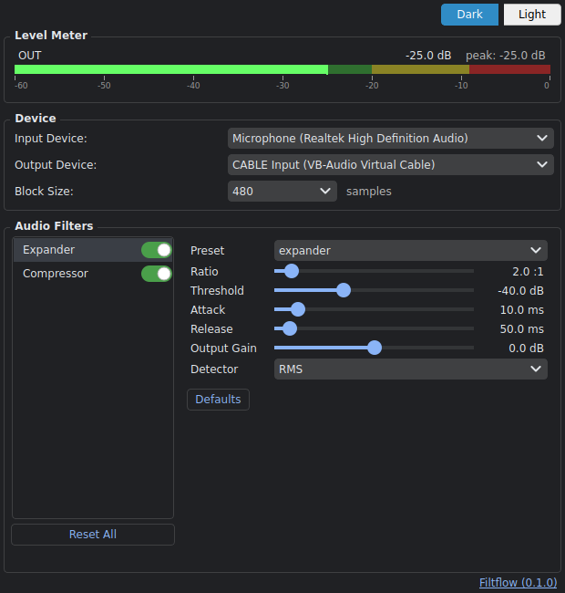
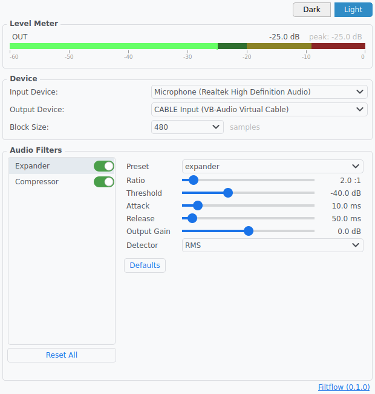

# Filtflow

A resident tool that applies an expander and compressor in real time to any microphone input, delivering filtered audio to all applications on Windows.

Filter algorithms are **derived from OBS Studio audio filter functionality (GPL-2.0)**.

## Screenshots

| Dark | Light |
|:----:|:-----:|
|  |  |

## Requirements

- OS: Windows 10 / 11
- Virtual audio device: [VB-Cable](https://vb-audio.com/Cable/) (separate installation required)

## Installation

### 1. Install VB-Cable

Filtflow routes filtered audio to communication apps (Discord, Teams, etc.) through a virtual audio device. VB-Cable must be installed beforehand.

1. Download the installer from the [VB-Cable website](https://vb-audio.com/Cable/)
2. Run `VBCABLE_Setup_x64.exe` **as administrator** to install
3. Reboot your PC if prompted

### 2. Install Filtflow

1. Download the latest `Filtflow_v*.zip` from [GitHub Releases](https://github.com/baibai25/filtflow/releases)
2. Extract the zip to any folder
3. Run `Filtflow.exe`

> **Note:** The extracted folder contains a `source/` folder (source code), which can be safely deleted. Only `Filtflow.exe` is required to run the application.

## Usage

On launch, no window appears — the app resides in the system tray.

1. Right-click the tray icon → "Settings" to open the settings window
2. Select your input microphone and output device (VB-Cable), then adjust filter parameters
3. In your communication app, set the microphone to **"CABLE Output (VB-Audio Virtual Cable)"**

> The tray icon turns red on device error.

## Config File

```text
%APPDATA%\Filtflow\config.json
```

Auto-generated with OBS default values on first launch.

## For Developers

### Setup

```bash
# Install dependencies
uv sync

# Generate icons (first time only)
cd Filtflow/assets && uv run python create_icons.py && cd ../..

# Launch
uv run python Filtflow/main.py
```

### File Structure

```text
Filtflow/
├── main.py              Entry point / launch control
├── audio_stream.py      Device enumeration / WASAPI stream management
├── compressor.py        Compressor filter (OBS-based)
├── expander.py          Expander filter (OBS-based)
├── config.py            Settings definition / load / save
├── ui.py                Settings UI (PySide6)
├── tray.py              System tray (QSystemTrayIcon)
├── filtflow.spec        PyInstaller build config
└── assets/
    ├── create_icons.py  Icon generation script (icon.png / icon.ico)
    ├── icon.png         Tray icon (generated by create_icons.py)
    └── icon.ico         Exe icon (generated by create_icons.py)
```

### Building an Executable

```bash
# If icons have not been generated yet
cd Filtflow/assets && uv run python create_icons.py && cd ../..

cd Filtflow
uv run pyinstaller filtflow.spec
# → Filtflow/dist/Filtflow.exe
```

`console=False` hides the console window.

## License

This project is licensed under the [GNU General Public License v2 or later (GPL-2.0-or-later)](../LICENSE).

The audio filters in this project are re-implemented in Python
based on the audio filter functionality (C implementation) of [OBS Studio](https://github.com/obsproject/obs-studio).
OBS Studio is licensed under GPL-2.0-or-later, and this project follows the same license.
